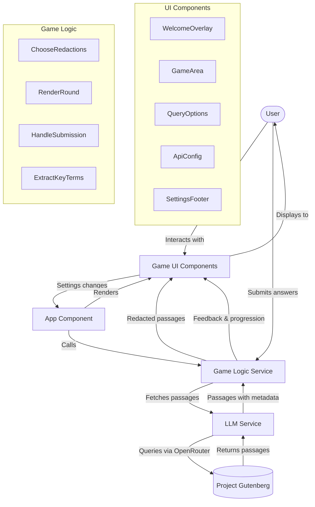

# Cloze Reader Game

This is a web-based game where users can infer redacted words in passages fetched from Project Gutenberg.

The game utilizes tool calling capabilities to interact with external services. Specifically, it uses an OpenRouter tool to communicate with a language model.

The language model plays a crucial role in this game by:
- Fetching passages from Project Gutenberg via the Gutenberg service.
- Redacting tokens from the fetched passages to create the cloze test format.

This project is deployed on GitHub Pages via a GitHub Actions workflow.

## How to Play

(Instructions on how to play the game would go here)

## Development

(Information on setting up and running the project locally would go here)

## Technologies Used

- React
- TypeScript
- Parcel
- Tailwind CSS
- OpenRouter (via tool calling)
- Project Gutenberg API (via service)

## License

This project is licensed under the GPL-3.0 License.

## Project Architecture

*Diagram generated on 5/21/2025, 11:24:23 AM*
