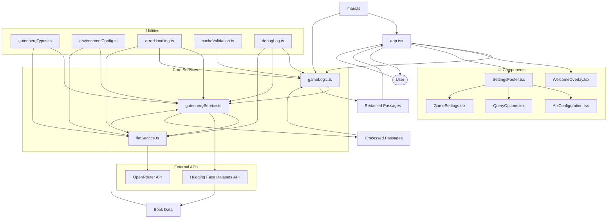

# Cloze Reader Game

Inspired by the cloze deletion test, this reading game  creates fill-in-the-blank exercises from Project Gutenberg literature, using tool calls with `gemini-1.5-flash-001` to select a passage from local Gutenberg texts and transpose it redacted to the game area where the player is asked to fill in the blank. 

Click `Analysis` at the end of the round to enact another tool call in which the same flash model is instructed to provide either a factoid about the book or author or close read the  missing word in the context of the passage. It also includes a basic difficulty range (1-5 levels) that scales from elementary to expert complexity and is good at least for an idiosyncratic reading experience — but only if you read clozely.

## Key Features

The game utilizes  tool calling capabilities with OpenRouter to:

- **Stochastically sample passages** with difficulty-appropriate complexity
- **Apply contextual redactions** that match the target learning level
- **Provide analytical insights** through word analysis and factoids

## **Deployment**

This project is deployed on GitHub Pages with automated CI/CD via GitHub Actions.

### **Live Demo**: [Cloze Reader Game](https://your-username.github.io/cloze-reader)

### **Local Dataset Features**
- **50+ curated books** from Project Gutenberg in `src/assets/datasets/`
- **Genre-specific collections**: Fiction, Poetry, General Literature
- **Quality-filtered content** with educational metadata
- **Offline-capable** gameplay with local content processing

## How to Play

### 🎮 **Game Flow**
1. **Start**: Click "Start Game" to begin with Level 1 (Elementary)
2. **Read**: Study the passage—words are strategically hidden based on difficulty
3. **Fill**: Type your guesses for the missing words in the input fields
4. **Submit**: Get immediate feedback with correct/incorrect highlighting
5. **Progress**: Pass rounds (≥70% correct) to advance through difficulty levels
6. **Learn**: Use hints, view word analysis, and discover book factoids

### 📈 **Difficulty Progression**
- **Level 1 (Elementary)**: 1 blank, simple vocabulary, basic sentence structure
- **Level 2 (Basic)**: 1 blank, everyday vocabulary, moderate complexity
- **Level 3 (Intermediate)**: 2 blanks, varied vocabulary, balanced complexity
- **Level 4 (Advanced)**: 2-3 blanks, sophisticated vocabulary, longer sentences
- **Level 5 (Expert)**: 3+ blanks, literary language, complex sentence structures

### ⚙️ **Customization Options**
- **Category Selection**: Fiction, Poetry, General Literature
- **Author Filtering**: Target specific authors or time periods
- **Century Selection**: Focus on particular literary eras
- **API Configuration**: Configure OpenRouter settings for enhanced features

## Development

To run this project locally:

1. Clone the repository
2. Install dependencies:

   ```bash
   npm install
   ```

3. Start the development server:

   ```bash
   npm run dev
   ```

4. Open your browser at `http://localhost:1234`

The application connects directly to the Gutendex API ([https://gutendex.com/books](https://gutendex.com/books)) and does not require any local server setup.

Note: For GitHub Pages deployment, make sure to:

1. Run `npm run build` to create optimized files
2. Run `npm run deploy` to publish to GitHub Pages

## Technologies Used

- React
- TypeScript
- Parcel
- Tailwind CSS
- OpenRouter (via tool calling)
- Project Gutenberg API (via service)

## License

This project is licensed under the GPL-3.0 License.

## Project Architecture


Diagram updated on 5/23/2025

## Codebase Structure



Diagram updated on 5/25/2025
