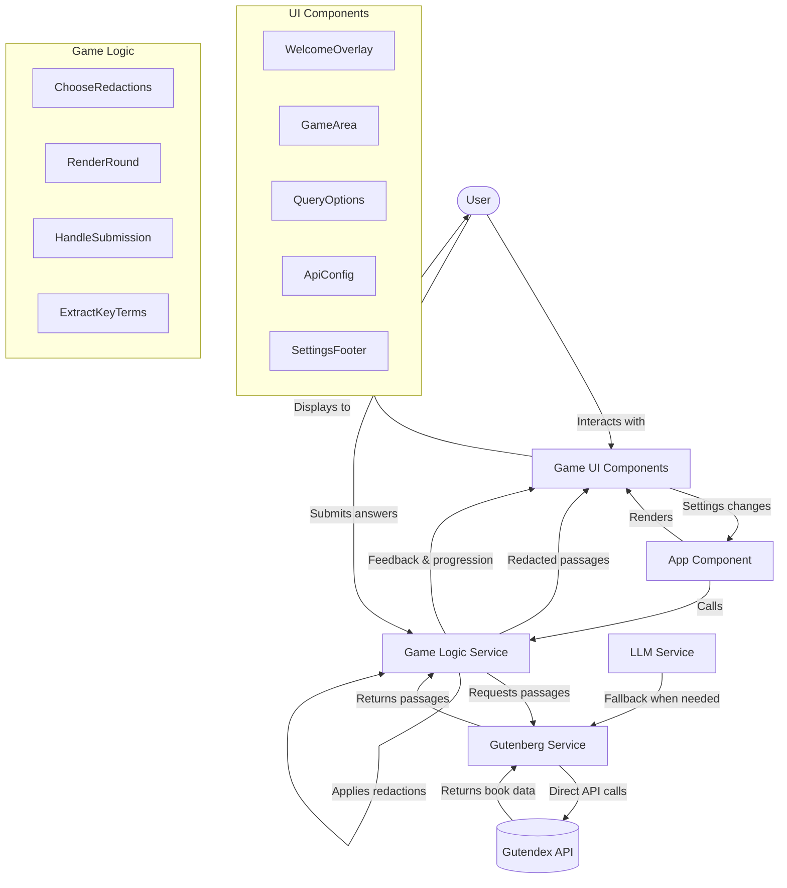

# Cloze Reader Game

This is a web-based game where users can infer redacted words in passages fetched from Project Gutenberg.

The game utilizes tool calling capabilities to interact with external services. Specifically, it uses an OpenRouter tool to communicate with a language model.

The language model plays a crucial role in this game by:

- Fetching passages from Project Gutenberg via the Gutendex API.
- Redacting tokens from the fetched passages to create the cloze test format.

This project is deployed on GitHub Pages via a GitHub Actions workflow.

## How to Play

1. Click "Start Game" to fetch a passage.
2. Read the passage—some words will be hidden (cloze deletions).
3. Type your guesses for the missing words in the blanks.
4. Submit your answers to see which are correct.
5. Continue to the next round or try a new passage.

You can adjust settings such as difficulty and source book in the options menu.

## Development

To run this project locally:

1. Clone the repository
2. Install dependencies:
   ```
   npm install
   ```
3. Start the development server:
   ```
   npm run dev
   ```
4. Open your browser at `http://localhost:1234`

The application connects directly to the Gutendex API (https://gutendex.com/books) and does not require any local server setup.

Note: For GitHub Pages deployment, make sure to:
1. Run `npm run build` to create optimized files
2. Run `npm run deploy` to publish to GitHub Pages

## Technologies Used

- React
- TypeScript
- Parcel
- Tailwind CSS
- OpenRouter (via tool calling)
- Project Gutenberg API (via service)

## License

This project is licensed under the GPL-3.0 License.

## Project Architecture



*Diagram updated on 5/23/2025*

## Codebase Structure


*Diagram updated on 5/25/2025*
