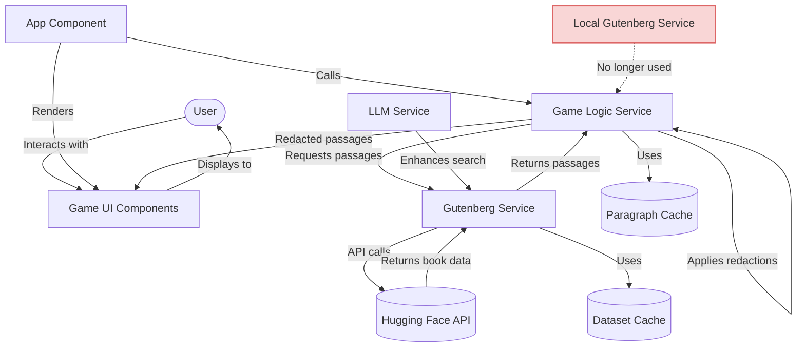
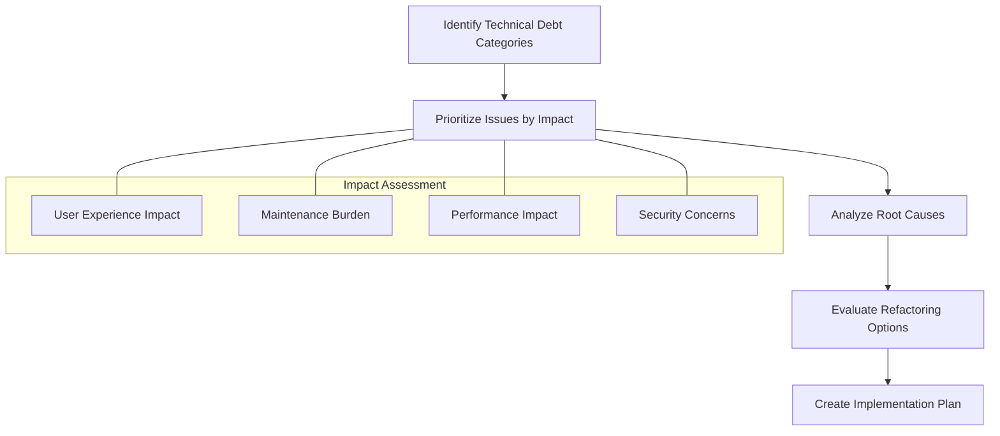
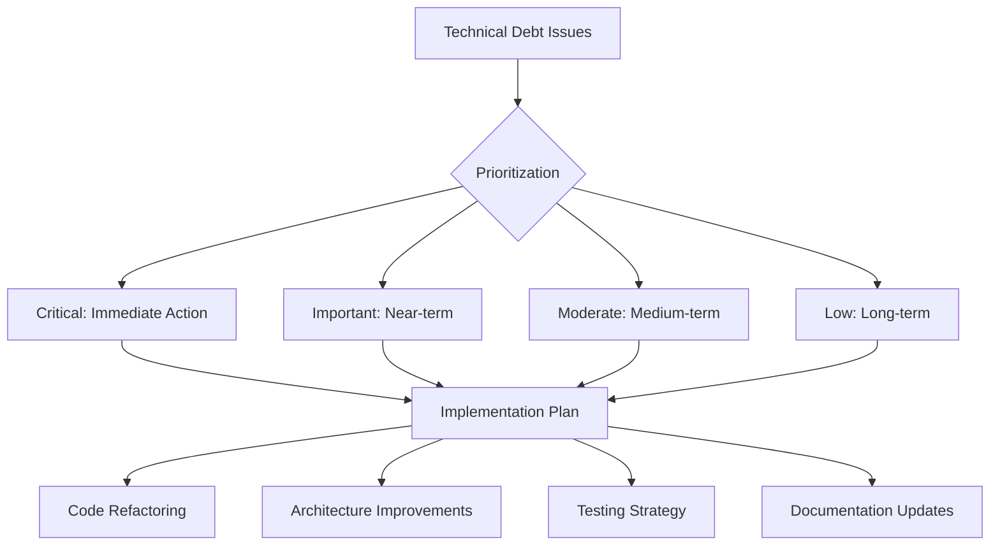

# Technical Debt Assessment Plan: Cloze Reader Migration Analysis

## Executive Summary

This document outlines a comprehensive plan to assess and address technical debt in the Cloze Reader application, focusing on issues introduced during the recent migration from local JSON files to the Hugging Face Datasets API. The plan identifies key areas of technical debt, provides a methodology for assessment, and outlines recommendations for short, medium, and long-term improvements.

## 1. Current Architecture Overview

The Cloze Reader is a web-based game where users infer redacted words in passages fetched from Project Gutenberg. The application has recently migrated from using local JSON files to directly fetching data from the Hugging Face Datasets API.



### 1.1 Key Components

- **main.ts**: Entry point and core game logic
- **gameLogic.ts**: Game mechanics and UI rendering
- **gutenbergService.ts**: Data fetching from Hugging Face Datasets API
- **llmService.ts**: Integration with language models via OpenRouter
- **environmentConfig.ts**: Configuration management
- **UI Components**: Preact components for settings and game interface

### 1.2 Data Flow

1. The application initializes in main.ts
2. User interactions trigger game rounds via gameLogicStartRound
3. Data is fetched from the Hugging Face Datasets API via gutenbergService.ts
4. The LLM service is used for enhancing search results and generating hints
5. Game state is managed in gameLogic.ts
6. UI updates are handled through a mix of direct DOM manipulation and Preact components

## 2. Technical Debt Identification

### 2.1 Code Organization Issues

#### 2.1.1 Dead Code

- **Unused Files**: The `localGutenbergService.ts` file still exists but is unused, creating confusion and maintenance overhead.
  ```typescript
  // src/services/localGutenbergService.ts
  // This entire file (252 lines) is no longer used but remains in the codebase
  ```

- **Commented References**: Several comments reference removed functions, creating confusion.
  ```typescript
  // main.ts (line 71)
  // Function removed - we only use Hugging Face dataset API
  
  // main.ts (line 408)
  // findRelatedBooks is removed
  
  // main.ts (line 427)
  // Removed cacheDOMElements and attachEventListeners from main.ts
  ```

#### 2.1.2 Architectural Inconsistencies

- **Mixed UI Approaches**: The codebase uses both direct DOM manipulation in gameLogic.ts and Preact components, creating inconsistency.
  ```typescript
  // Direct DOM manipulation in gameLogic.ts
  paragraphElement.className = 'typewriter-text leading-relaxed break-words';
  gameArea.appendChild(paragraphElement);
  
  // vs. Preact components in ApiConfiguration.tsx
  export const ApiConfiguration: FunctionComponent<ApiConfigurationProps> = ({ 
    isRemoteInterface = window.location.hostname.includes('github.io')
  }) => { ... }
  ```

- **Unclear Service Boundaries**: There's overlap between main.ts and gameLogic.ts, with both handling aspects of game logic.
  ```typescript
  // In main.ts
  export async function fetchGutenbergPassage(...): Promise<PassageData | null> { ... }
  
  // In gameLogic.ts
  export async function startRound(forceNewPassage: boolean = false): Promise<object | null> { ... }
  ```

#### 2.1.3 Duplicate Caching Mechanisms

- **Multiple Cache Implementations**: The application has separate caching mechanisms in different files.
  ```typescript
  // In gutenbergService.ts
  const datasetCache = new Map<string, { data: HuggingFaceBook[], timestamp: number }>();
  
  // In gameLogic.ts
  const paragraphCache: ParagraphCache = {
    cache: {},
    maxSize: 10,
    set: function(key, value) { ... },
    get: function(key) { ... },
    init: function() { ... }
  };
  ```

### 2.2 Data Handling Issues

#### 2.2.1 Complex Cache Validation

- **Extensive Integrity Checking**: The startRound function has complex logic for cache validation.
  ```typescript
  // In gameLogic.ts (lines 629-723)
  // --- INTEGRITY CHECK: Validate cached metadata and passage text against HuggingFace Project Gutenberg dataset ---
  // If the metadata.id is present, fetch metadata and compare title/author.
  // Also, fetch the first 200 chars of the actual book and compare to the cached passage.
  let integrityCheckPassed = true;
  if (passageData.metadata && passageData.metadata.id && passageData.metadata.id > 0) {
    const checkMetadataAndText = async () => { ... }
    // Await the integrity check before proceeding
    await checkMetadataAndText();
  }
  ```

#### 2.2.2 Error Handling Inconsistencies

- **Varied Error Handling Approaches**: Different parts of the codebase handle errors differently.
  ```typescript
  // In gutenbergService.ts - Using try/catch with detailed logging
  try {
    // API call logic
  } catch (error) {
    console.error("Error searching Gutenberg books:", error);
    return [];
  }
  
  // In gameLogic.ts - Using console.error without structured handling
  if (!domElements) {
    console.error("DOM elements not initialized for gameLogic.startRound");
    return null;
  }
  ```

#### 2.2.3 API Integration Challenges

- **Direct API Dependency**: The code is tightly coupled to the Hugging Face API structure.
  ```typescript
  // In gutenbergService.ts
  const url = `https://datasets-server.huggingface.co/rows?${params.toString()}`;
  // Direct dependency on API response format
  books = responseData.rows.map((r: any) => {
    const row = r.row;
    // Processing specific to this API format
  });
  ```

### 2.3 UI/UX Technical Debt

#### 2.3.1 DOM Manipulation vs. Component Architecture

- **Direct DOM Manipulation**: Many UI elements are created and manipulated directly.
  ```typescript
  // In gameLogic.ts
  const paragraphElement = document.createElement('p');
  paragraphElement.className = 'typewriter-text leading-relaxed break-words';
  gameArea.appendChild(paragraphElement);
  ```

#### 2.3.2 Code Duplication

- **Duplicate Display Logic**: Similar code for displaying bibliographic information appears in multiple places.
  ```typescript
  // In gameLogic.ts (lines 732-762 and 842-872)
  // First instance
  if (bibliographicArea && passageData.metadata) {
    let authorDisplayHTML = passageData.metadata.author;
    let factoidDisplayHTML = '';
    // ... similar logic repeated
    const biblioHTML = `
      <h2 class="text-xl font-semibold mb-2 typewriter-text">${passageData.metadata.title}</h2>
      <p class="typewriter-text">By ${authorDisplayHTML}</p>
      ${factoidDisplayHTML}
    `;
    bibliographicArea.innerHTML = biblioHTML;
  }
  
  // Second instance
  if (bibliographicArea && clozeResult.metadata) {
    let authorDisplayHTML = clozeResult.metadata.author;
    let factoidDisplayHTML = '';
    // ... similar logic repeated
    const biblioHTML = `
      <h2 class="text-xl font-semibold mb-2 typewriter-text">${clozeResult.metadata.title}</h2>
      <p class="typewriter-text">By ${authorDisplayHTML}</p>
      ${factoidDisplayHTML}
    `;
    bibliographicArea.innerHTML = biblioHTML;
  }
  ```

## 3. Assessment Methodology



### 3.1 Impact Assessment Criteria

Each technical debt issue will be evaluated based on:

1. **User Experience Impact**
   - Does it affect application reliability?
   - Does it impact performance from the user's perspective?
   - Does it create inconsistent behavior?

2. **Maintenance Burden**
   - How difficult is it to understand and modify the code?
   - Does it create confusion for developers?
   - Does it increase the risk of introducing bugs during changes?

3. **Performance Impact**
   - Does it affect application loading time?
   - Does it create unnecessary network requests?
   - Does it cause memory leaks or excessive resource usage?

4. **Security Concerns**
   - Does it expose sensitive information?
   - Does it create potential vulnerabilities?
   - Does it handle user data appropriately?

### 3.2 Prioritization Matrix

Issues will be categorized using the following matrix:

| Impact | Effort | Priority |
|--------|--------|----------|
| High   | Low    | Critical |
| High   | Medium | High     |
| High   | High   | Medium   |
| Medium | Low    | High     |
| Medium | Medium | Medium   |
| Medium | High   | Low      |
| Low    | Low    | Medium   |
| Low    | Medium | Low      |
| Low    | High   | Backlog  |

## 4. Detailed Analysis Plan

### 4.1 Code Structure Analysis

#### 4.1.1 Analyze Service Boundaries

1. **Map Current Responsibilities**
   - Document the responsibilities of each service
   - Identify overlaps and gaps

2. **Evaluate Cohesion and Coupling**
   - Assess how tightly coupled the services are
   - Identify opportunities for better separation of concerns

3. **Propose Improved Service Boundaries**
   - Define clear responsibilities for each service
   - Document interfaces between services

#### 4.1.2 Evaluate Component Architecture

1. **Identify UI Elements Suitable for Components**
   - Map current DOM manipulations
   - Determine which should be converted to components

2. **Design Component Hierarchy**
   - Create a component tree
   - Define props and state for each component

3. **Plan Migration Path**
   - Prioritize components for conversion
   - Define approach for incremental migration

#### 4.1.3 Identify Dead Code

1. **Analyze Code Usage**
   - Use static analysis to identify unused code
   - Document references to removed functionality

2. **Create Removal Plan**
   - Prioritize dead code for removal
   - Identify potential risks of removal

### 4.2 Data Flow Analysis

#### 4.2.1 Map Caching Mechanisms

1. **Document Current Caching**
   - Identify all caching implementations
   - Map cache keys, values, and expiration policies

2. **Analyze Cache Usage Patterns**
   - Identify when caches are read and written
   - Evaluate cache hit/miss patterns

3. **Design Unified Caching Strategy**
   - Define a consistent caching approach
   - Plan migration to unified caching

#### 4.2.2 Analyze Error Handling Patterns

1. **Document Error Handling Approaches**
   - Identify all error handling patterns
   - Map error propagation paths

2. **Evaluate Error Recovery**
   - Assess how the application recovers from errors
   - Identify potential failure points

3. **Design Consistent Error Handling**
   - Define standard error handling patterns
   - Plan implementation of consistent approach

#### 4.2.3 Evaluate API Integration

1. **Map API Dependencies**
   - Document all external API calls
   - Identify tight coupling to API structures

2. **Design Abstraction Layer**
   - Define interfaces for API interactions
   - Plan implementation of abstraction layer

### 4.3 Performance Analysis

#### 4.3.1 Evaluate Cache Efficiency

1. **Analyze Cache Hit Rates**
   - Instrument code to measure cache performance
   - Identify opportunities for improvement

2. **Optimize Cache Strategies**
   - Define optimal cache sizes and expiration policies
   - Plan implementation of improvements

#### 4.3.2 Review Network Request Patterns

1. **Map API Request Frequency**
   - Document when and how often API requests are made
   - Identify unnecessary or redundant requests

2. **Optimize Request Patterns**
   - Define strategies to reduce API calls
   - Plan implementation of optimizations

## 5. Recommendations Framework



### 5.1 Critical Issues (Immediate Action)

1. **Remove Dead Code**
   - Remove localGutenbergService.ts
   - Clean up commented references to removed functions
   - Impact: High, Effort: Low

2. **Fix Inconsistent Error Handling**
   - Standardize error handling patterns
   - Improve error propagation
   - Impact: High, Effort: Medium

3. **Address Cache Integrity Issues**
   - Simplify cache validation logic
   - Implement more robust integrity checking
   - Impact: High, Effort: Medium

### 5.2 Important Issues (Near-term)

1. **Consolidate Caching Mechanisms**
   - Create a unified caching service
   - Standardize cache invalidation logic
   - Impact: Medium, Effort: Medium

2. **Reduce Code Duplication**
   - Extract common patterns into reusable functions
   - Implement DRY principles for similar code blocks
   - Impact: Medium, Effort: Low

3. **Improve API Abstraction**
   - Create a data access layer to abstract API details
   - Implement better retry and fallback mechanisms
   - Impact: Medium, Effort: Medium

### 5.3 Moderate Issues (Medium-term)

1. **Refactor DOM Manipulation to Components**
   - Convert game area rendering to Preact components
   - Implement proper component lifecycle management
   - Impact: Medium, Effort: High

2. **Clarify Service Boundaries**
   - Refactor overlapping responsibilities
   - Define clear interfaces between services
   - Impact: Medium, Effort: Medium

3. **Implement Comprehensive Logging**
   - Standardize logging approach
   - Add structured logging for better debugging
   - Impact: Medium, Effort: Low

### 5.4 Low Priority Issues (Long-term)

1. **Complete Component Architecture**
   - Migrate all direct DOM manipulation to components
   - Implement proper state management
   - Impact: Low, Effort: High

2. **Service Layer Refinement**
   - Clearly define service boundaries
   - Implement proper dependency injection
   - Impact: Low, Effort: High

3. **Comprehensive Testing Strategy**
   - Implement unit tests for core functionality
   - Add integration tests for API interactions
   - Impact: Medium, Effort: High

## 6. Implementation Planning

### 6.1 Short-term Implementation (1-2 Weeks)

#### 6.1.1 Remove Dead Code

1. **Remove localGutenbergService.ts**
   - Delete the file
   - Remove any imports or references

2. **Clean Up Comments**
   - Remove or update outdated comments
   - Add clear documentation for current functionality

3. **Update Documentation**
   - Document the removal of local data handling
   - Update architecture diagrams

#### 6.1.2 Standardize Error Handling

1. **Define Error Handling Pattern**
   - Create standard error types
   - Define error propagation approach

2. **Implement in GutenbergService**
   - Refactor error handling in API calls
   - Implement consistent error propagation

3. **Implement in GameLogic**
   - Refactor error handling in game logic
   - Ensure proper error display to users

#### 6.1.3 Simplify Cache Validation

1. **Review Current Validation Logic**
   - Analyze the complexity of current validation
   - Identify simplification opportunities

2. **Implement Simplified Approach**
   - Refactor cache validation logic
   - Ensure robust but simpler integrity checking

3. **Add Monitoring**
   - Implement logging for cache validation
   - Track validation success/failure rates

### 6.2 Medium-term Implementation (2-4 Weeks)

#### 6.2.1 Create Unified Caching Service

1. **Design Caching Interface**
   - Define standard cache operations
   - Design cache invalidation approach

2. **Implement Cache Service**
   - Create a shared caching service
   - Implement storage, retrieval, and invalidation

3. **Migrate Existing Caches**
   - Update gutenbergService.ts to use the new cache
   - Update gameLogic.ts to use the new cache

#### 6.2.2 Extract Common Patterns

1. **Identify Duplication**
   - Document duplicated code patterns
   - Prioritize for extraction

2. **Create Utility Functions**
   - Extract common logic to utility functions
   - Ensure proper error handling and typing

3. **Refactor Existing Code**
   - Update code to use new utility functions
   - Verify functionality after refactoring

#### 6.2.3 Improve API Abstraction

1. **Design Data Access Layer**
   - Define interfaces for API interactions
   - Design error handling and retry logic

2. **Implement Abstraction Layer**
   - Create service for API interactions
   - Implement retry and fallback mechanisms

3. **Migrate Existing Code**
   - Update gutenbergService.ts to use the new layer
   - Verify functionality after migration

### 6.3 Long-term Implementation (1-3 Months)

#### 6.3.1 Component Architecture Migration

1. **Design Component Hierarchy**
   - Define component structure
   - Design props and state management

2. **Implement Core Components**
   - Create components for game area
   - Implement proper lifecycle management

3. **Migrate DOM Manipulation**
   - Gradually replace direct DOM manipulation
   - Verify functionality after each migration step

#### 6.3.2 Service Layer Refinement

1. **Define Service Boundaries**
   - Document clear responsibilities for each service
   - Design interfaces between services

2. **Implement Service Interfaces**
   - Create well-defined interfaces
   - Implement proper dependency management

3. **Refactor Existing Services**
   - Update services to follow new boundaries
   - Verify functionality after refactoring

#### 6.3.3 Testing Strategy Implementation

1. **Define Testing Approach**
   - Document testing strategy
   - Set up testing infrastructure

2. **Implement Unit Tests**
   - Create tests for core functionality
   - Ensure good coverage of critical paths

3. **Implement Integration Tests**
   - Create tests for API interactions
   - Verify end-to-end functionality

## 7. Documentation and Knowledge Transfer

### 7.1 Architecture Documentation

1. **Update Architecture Diagrams**
   - Create current state diagram
   - Create target state diagram

2. **Document Service Responsibilities**
   - Define clear responsibilities for each service
   - Document interfaces between services

3. **Create Data Flow Documentation**
   - Document how data flows through the application
   - Highlight key transformation points

### 7.2 Migration Notes

1. **Document Migration Process**
   - Record the migration from local data to API
   - Document key decisions and trade-offs

2. **Create Migration Guide**
   - Provide guidance for future migrations
   - Document lessons learned

### 7.3 Code Style Guidelines

1. **Define Coding Standards**
   - Document preferred patterns and practices
   - Create examples of good code

2. **Implement Linting Rules**
   - Set up linting to enforce standards
   - Document linting configuration

## 8. Conclusion

This technical debt assessment plan provides a comprehensive approach to identifying, prioritizing, and addressing technical debt in the Cloze Reader application. By following this plan, the team can systematically improve the codebase, making it more maintainable, performant, and reliable.

The plan emphasizes a balanced approach, addressing critical issues quickly while planning for longer-term architectural improvements. By implementing these recommendations, the application will be better positioned for future enhancements and maintenance.